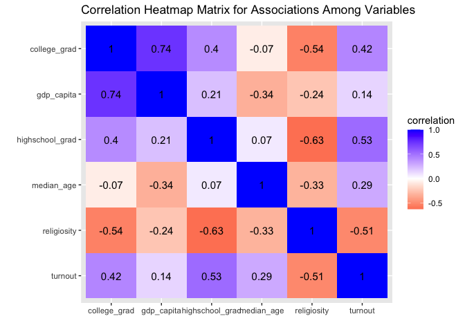
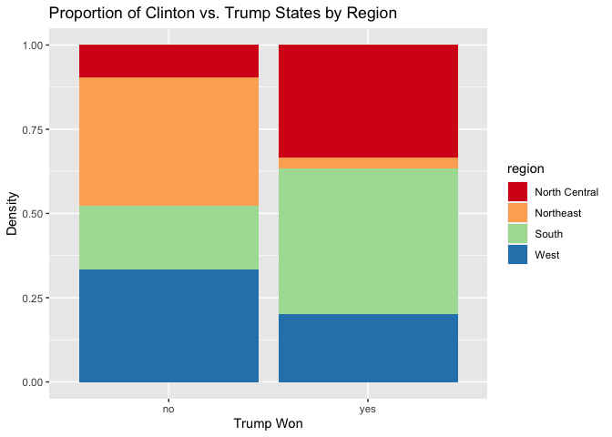
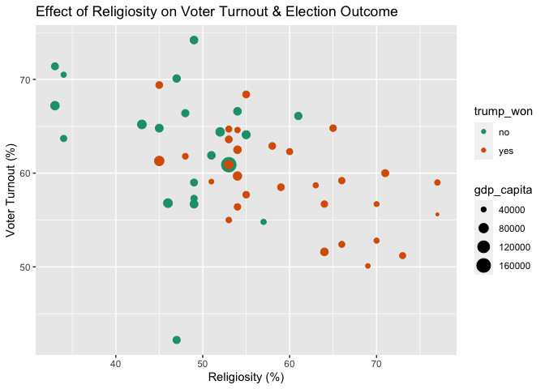
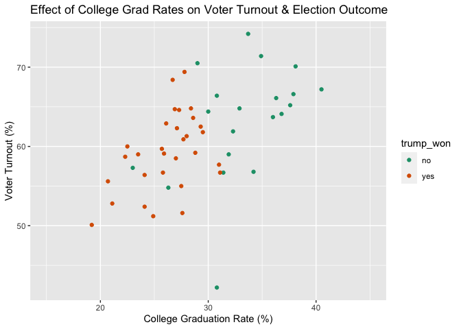
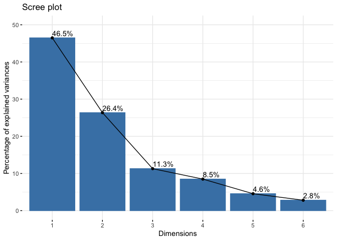
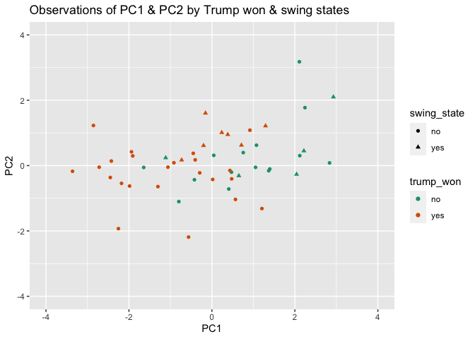
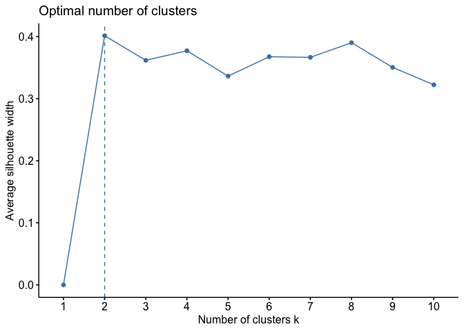
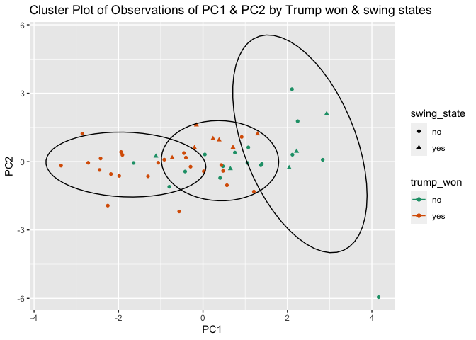

Exploratory Data Analysis - 2016 U.S. Election
================
Imtiaz Rashid
3/22/2021

## 1\. Introduction

<style>
body {
text-align: justify}
</style>

Politics permeates every aspect of our lives. The leaders we elect has
tremendous impact on the direction that our country and the overall
world goes in. The 2016 United States presidential election has been
noted as one of the most significant election in modern U.S. history
where Donald Trump pulled a stunning upset victory over Hillary Clinton
based on a number of factors missed by the media and the political
class. Despite the historical weight attached to the election, data had
revealed that only half of eligible Americans voted at all.

The consumption of politics has always been a keen interest of mine and
the diverse factors that compose and influence it. As such, a thorough
exploratory data analysis was conducted to explain the outcome of the
election.

#### Dataset Descriptions

The first dataset, **election**, was obtained from Vincent
Arel-Bundock’s Github containing a list of R datasets. The dataset
contain the following variables: the region that a state is classified
as according to the U.S. census, voter turnout rate (%), highschool and
college graduation rate (%), GDP per capita ($), whether a state was won
by Trump or not and in addition to being classified as a swing state or
not.

The second dataset, **age\_religion**, is composed of data from the
CIA’s World Factvook and the Pew Research Center. The dataset is
composed of the following variables: religiosity (%) and median age of
each state (years).

The two datasets were merged into one full dataset, **USelection**. Both
of the original datasets contained the common variable of state, which
is all 50 states of the United States plus the city of Washington D.C.
The final dataset contains 10 variables with 51 observations.

#### Significance & Projections

The exploratory data analysis will examine, discover, and report on the
potential associations of the demographics variables that affect the
2016 U.S. presidential election and how it may have contributed to
Trump’s win. It is expected that factors such as religiosity, college
education level, and GDP per capita may be the most significant
potential associations in explaining the outcome of Tuesday, November
8th, 2016.

## 2\. Tidy

In a tidy dataset, each variable is saved in its own column and each
observation is saved in its own row. Tidy data complements R’s
vectorized operations as it automatically preserves observations as
variables are manipulated. Based on these conditions, each dataset is
already tidy as acquired based on observation and thus requires no
further modifications.

Each dataset however underwent a cleaning process in removing extraneous
variables, renaming the chosen variables for clarity, and replacing
binary values of some categorical variables with descriptive values
instead.

``` r
# Opens 'election' dataset in R
library(readxl)
election <- read_excel("election_turnout.xlsx")

# Cleans up 'election' dataset
election <- election %>%
   # Removes extraneous variables
  select(-x, -year, -division) %>%  
  # Renames variables for clarity
  rename(turnout="turnoutho", highschool_grad="perhsed", college_grad="percoled", gdp_capita="gdppercap", swing_state="ss", trump_won="trumpw") %>%
  # Changes binary "1", "0" values to "yes", "no" respectively across categorical variables
  mutate(across(c(swing_state, trump_won),
                ~factor(ifelse(.x=="1", "yes", "no"))))

# Shows dataset & can observe for tidy data
print(election)
```

    ## # A tibble: 51 x 8
    ##    state      region turnout highschool_grad college_grad gdp_capita swing_state
    ##    <chr>      <chr>    <dbl>           <dbl>        <dbl>      <dbl> <fct>      
    ##  1 Alabama    South     59              84.3         23.5      42663 no         
    ##  2 Alaska     West      61.3            92.1         28        81801 no         
    ##  3 Arizona    West      55              86           27.5      43269 no         
    ##  4 Arkansas   South     52.8            84.8         21.1      41129 no         
    ##  5 California West      56.7            81.8         31.4      61924 no         
    ##  6 Colorado   West      70.1            90.7         38.1      58009 yes        
    ##  7 Connectic… North…    65.2            89.9         37.6      72331 no         
    ##  8 Delaware   South     64.4            88.4         30        69930 no         
    ##  9 District … South     60.9            89.3         54.6     181185 no         
    ## 10 Florida    South     64.6            86.9         27.3      42595 yes        
    ## # … with 41 more rows, and 1 more variable: trump_won <fct>

The **election** dataset contains 8 variables with 51 observations. Each
variable is saved in its own column and each observation is saved in its
own row.

``` r
# Opens 'age_religion' dataset in R
library(readxl)
age_religion <- read_excel("age_religion.xlsx")

# Shows dataset & can observe for tidy data
print(age_religion)
```

    ## # A tibble: 51 x 3
    ##    state                median_age religiosity
    ##    <chr>                     <dbl>       <dbl>
    ##  1 Alabama                    39.2          77
    ##  2 Alaska                     34.6          45
    ##  3 Arizona                    37.9          53
    ##  4 Arkansas                   38.3          70
    ##  5 California                 36.8          49
    ##  6 Colorado                   36.9          47
    ##  7 Connecticut                41            43
    ##  8 Delaware                   40.7          52
    ##  9 District of Columbia       34            53
    ## 10 Florida                    42.2          54
    ## # … with 41 more rows

The **age\_religion** dataset contains 3 variables with 51 observations.
Each variable is saved in its own column and each observation is saved
in its own row.

**The common variable between the two datasets are “state”, which are
the 50 states of the United States and Washington D.C.**

## 3\. Join/Merge

Facilitation of data entry is often simpler by organizing and entering
data in multiple tables where the relations between the tables need to
be defined in order to join datasets using keys. A full join was
conducted to merge the datasets **election** and **age\_religion** via
the common variable “state”.

A full join keeps all rows from both datasets where the number of rows
is equal to the union of key values. NA values would be introduced if
there is no match in one of the datasets.

A new combined dataset was created and labeled as **USelection**. The
join ensures that all variables from both datasets were included in the
final dataset. No variables had any missing data and no cases in the
final dataset were dropped.

``` r
# Merges 'election' & 'age_religion' datsets by keeping all rows & observations from both datasets
USelection <- election %>%
  full_join(age_religion, by="state") %>%
  # Reorders appearance of variables in dataset for clarity
  select(state, region, turnout, median_age, religiosity, highschool_grad, college_grad, gdp_capita, everything())

# Shows final dataset in tabular form
print(USelection)
```

    ## # A tibble: 51 x 10
    ##    state      region turnout median_age religiosity highschool_grad college_grad
    ##    <chr>      <chr>    <dbl>      <dbl>       <dbl>           <dbl>        <dbl>
    ##  1 Alabama    South     59         39.2          77            84.3         23.5
    ##  2 Alaska     West      61.3       34.6          45            92.1         28  
    ##  3 Arizona    West      55         37.9          53            86           27.5
    ##  4 Arkansas   South     52.8       38.3          70            84.8         21.1
    ##  5 California West      56.7       36.8          49            81.8         31.4
    ##  6 Colorado   West      70.1       36.9          47            90.7         38.1
    ##  7 Connectic… North…    65.2       41            43            89.9         37.6
    ##  8 Delaware   South     64.4       40.7          52            88.4         30  
    ##  9 District … South     60.9       34            53            89.3         54.6
    ## 10 Florida    South     64.6       42.2          54            86.9         27.3
    ## # … with 41 more rows, and 3 more variables: gdp_capita <dbl>,
    ## #   swing_state <fct>, trump_won <fct>

``` r
# Shows all variables of final dataset
glimpse(USelection)
```

    ## Rows: 51
    ## Columns: 10
    ## $ state           <chr> "Alabama", "Alaska", "Arizona", "Arkansas", "Californi…
    ## $ region          <chr> "South", "West", "West", "South", "West", "West", "Nor…
    ## $ turnout         <dbl> 59.0, 61.3, 55.0, 52.8, 56.7, 70.1, 65.2, 64.4, 60.9, …
    ## $ median_age      <dbl> 39.2, 34.6, 37.9, 38.3, 36.8, 36.9, 41.0, 40.7, 34.0, …
    ## $ religiosity     <dbl> 77, 45, 53, 70, 49, 47, 43, 52, 53, 54, 66, 47, 51, 51…
    ## $ highschool_grad <dbl> 84.3, 92.1, 86.0, 84.8, 81.8, 90.7, 89.9, 88.4, 89.3, …
    ## $ college_grad    <dbl> 23.5, 28.0, 27.5, 21.1, 31.4, 38.1, 37.6, 30.0, 54.6, …
    ## $ gdp_capita      <dbl> 42663, 81801, 43269, 41129, 61924, 58009, 72331, 69930…
    ## $ swing_state     <fct> no, no, no, no, no, yes, no, no, no, yes, no, no, no, …
    ## $ trump_won       <fct> yes, yes, yes, yes, no, no, no, no, no, yes, yes, no, …

The newly combined **USelection** dataset contains 10 variables with 51
observations.

## 4\. Summary Statistics

#### Filter

filter() chooses rows and observations of a dataset. The dataset was
explored by filtering certain values of respective categorical variables
as shown below.

``` r
# Filters dataset by states in the South
USelection %>% filter(region=="South")
```

    ## # A tibble: 17 x 10
    ##    state      region turnout median_age religiosity highschool_grad college_grad
    ##    <chr>      <chr>    <dbl>      <dbl>       <dbl>           <dbl>        <dbl>
    ##  1 Alabama    South     59         39.2          77            84.3         23.5
    ##  2 Arkansas   South     52.8       38.3          70            84.8         21.1
    ##  3 Delaware   South     64.4       40.7          52            88.4         30  
    ##  4 District … South     60.9       34            53            89.3         54.6
    ##  5 Florida    South     64.6       42.2          54            86.9         27.3
    ##  6 Georgia    South     59.2       36.9          66            85.4         28.8
    ##  7 Kentucky   South     58.7       38.9          63            84.2         22.3
    ##  8 Louisiana  South     60         37.2          71            83.4         22.5
    ##  9 Maryland   South     66.6       38.8          54            89.4         37.9
    ## 10 Mississip… South     55.6       37.7          77            82.3         20.7
    ## 11 North Car… South     64.8       38.9          65            85.8         28.4
    ## 12 Oklahoma   South     52.4       36.7          66            86.9         24.1
    ## 13 South Car… South     56.7       39.6          70            85.6         25.8
    ## 14 Tennessee  South     51.2       38.8          73            85.5         24.9
    ## 15 Texas      South     51.6       34.8          64            81.9         27.6
    ## 16 Virginia   South     66.1       38.4          61            88.3         36.3
    ## 17 West Virg… South     50.1       42.7          69            85           19.2
    ## # … with 3 more variables: gdp_capita <dbl>, swing_state <fct>, trump_won <fct>

``` r
# Filters dataset by swing states
USelection %>% select(state, swing_state, everything()) %>% filter(swing_state=="yes")
```

    ## # A tibble: 12 x 10
    ##    state     swing_state region   turnout median_age religiosity highschool_grad
    ##    <chr>     <fct>       <chr>      <dbl>      <dbl>       <dbl>           <dbl>
    ##  1 Colorado  yes         West        70.1       36.9          47            90.7
    ##  2 Florida   yes         South       64.6       42.2          54            86.9
    ##  3 Iowa      yes         North C…    68.4       38.2          55            91.5
    ##  4 Michigan  yes         North C…    64.7       39.8          53            89.6
    ##  5 Minnesota yes         North C…    74.2       38.1          49            92.4
    ##  6 Nevada    yes         West        57.3       38.1          49            85.1
    ##  7 New Hamp… yes         Northea…    71.4       43            33            92.3
    ##  8 North Ca… yes         South       64.8       38.9          65            85.8
    ##  9 Ohio      yes         North C…    62.9       39.4          58            89.1
    ## 10 Pennsylv… yes         Northea…    63.6       40.8          53            89.2
    ## 11 Virginia  yes         South       66.1       38.4          61            88.3
    ## 12 Wisconsin yes         North C…    69.4       39.6          45            91  
    ## # … with 3 more variables: college_grad <dbl>, gdp_capita <dbl>,
    ## #   trump_won <fct>

``` r
# Filters dataset by states Trump won
USelection %>% select(state, trump_won, everything()) %>% filter(trump_won=="yes")
```

    ## # A tibble: 30 x 10
    ##    state    trump_won region      turnout median_age religiosity highschool_grad
    ##    <chr>    <fct>     <chr>         <dbl>      <dbl>       <dbl>           <dbl>
    ##  1 Alabama  yes       South          59         39.2          77            84.3
    ##  2 Alaska   yes       West           61.3       34.6          45            92.1
    ##  3 Arizona  yes       West           55         37.9          53            86  
    ##  4 Arkansas yes       South          52.8       38.3          70            84.8
    ##  5 Florida  yes       South          64.6       42.2          54            86.9
    ##  6 Georgia  yes       South          59.2       36.9          66            85.4
    ##  7 Idaho    yes       West           59.1       36.6          51            89.5
    ##  8 Indiana  yes       North Cent…    56.4       37.9          54            87.8
    ##  9 Iowa     yes       North Cent…    68.4       38.2          55            91.5
    ## 10 Kansas   yes       North Cent…    57.7       36.9          55            90.2
    ## # … with 20 more rows, and 3 more variables: college_grad <dbl>,
    ## #   gdp_capita <dbl>, swing_state <fct>

#### Select

select() chooses columns and variables of a dataset. The dataset was
explored by selecting columns of interests together as shown below.

``` r
# Selects for politically related variables 
USelection %>% select(state, turnout, swing_state, trump_won)
```

    ## # A tibble: 51 x 4
    ##    state                turnout swing_state trump_won
    ##    <chr>                  <dbl> <fct>       <fct>    
    ##  1 Alabama                 59   no          yes      
    ##  2 Alaska                  61.3 no          yes      
    ##  3 Arizona                 55   no          yes      
    ##  4 Arkansas                52.8 no          yes      
    ##  5 California              56.7 no          no       
    ##  6 Colorado                70.1 yes         no       
    ##  7 Connecticut             65.2 no          no       
    ##  8 Delaware                64.4 no          no       
    ##  9 District of Columbia    60.9 no          no       
    ## 10 Florida                 64.6 yes         yes      
    ## # … with 41 more rows

``` r
# Selects for education related variables & whether Trump won the state
USelection %>% select(state, highschool_grad, college_grad, trump_won)
```

    ## # A tibble: 51 x 4
    ##    state                highschool_grad college_grad trump_won
    ##    <chr>                          <dbl>        <dbl> <fct>    
    ##  1 Alabama                         84.3         23.5 yes      
    ##  2 Alaska                          92.1         28   yes      
    ##  3 Arizona                         86           27.5 yes      
    ##  4 Arkansas                        84.8         21.1 yes      
    ##  5 California                      81.8         31.4 no       
    ##  6 Colorado                        90.7         38.1 no       
    ##  7 Connecticut                     89.9         37.6 no       
    ##  8 Delaware                        88.4         30   no       
    ##  9 District of Columbia            89.3         54.6 no       
    ## 10 Florida                         86.9         27.3 yes      
    ## # … with 41 more rows

#### Arrange

arrange() sorts row of a dataset. The dataset was explored by arranging
voter turnout in both ascending and descending order as shown below.

``` r
# Arranges voter turnout for each state in ascending order 
USelection %>% arrange(turnout)
```

    ## # A tibble: 51 x 10
    ##    state    region   turnout median_age religiosity highschool_grad college_grad
    ##    <chr>    <chr>      <dbl>      <dbl>       <dbl>           <dbl>        <dbl>
    ##  1 Hawaii   West        42.2       39.2          47            91           30.8
    ##  2 West Vi… South       50.1       42.7          69            85           19.2
    ##  3 Tenness… South       51.2       38.8          73            85.5         24.9
    ##  4 Texas    South       51.6       34.8          64            81.9         27.6
    ##  5 Oklahoma South       52.4       36.7          66            86.9         24.1
    ##  6 Arkansas South       52.8       38.3          70            84.8         21.1
    ##  7 New Mex… West        54.8       38.1          57            84.2         26.3
    ##  8 Arizona  West        55         37.9          53            86           27.5
    ##  9 Mississ… South       55.6       37.7          77            82.3         20.7
    ## 10 Indiana  North C…    56.4       37.9          54            87.8         24.1
    ## # … with 41 more rows, and 3 more variables: gdp_capita <dbl>,
    ## #   swing_state <fct>, trump_won <fct>

``` r
# Arranges voter turnout for each state in descending order
USelection %>% arrange(desc(turnout))
```

    ## # A tibble: 51 x 10
    ##    state    region   turnout median_age religiosity highschool_grad college_grad
    ##    <chr>    <chr>      <dbl>      <dbl>       <dbl>           <dbl>        <dbl>
    ##  1 Minneso… North C…    74.2       38.1          49            92.4         33.7
    ##  2 New Ham… Northea…    71.4       43            33            92.3         34.9
    ##  3 Maine    Northea…    70.5       44.9          34            91.6         29  
    ##  4 Colorado West        70.1       36.9          47            90.7         38.1
    ##  5 Wiscons… North C…    69.4       39.6          45            91           27.8
    ##  6 Iowa     North C…    68.4       38.2          55            91.5         26.7
    ##  7 Massach… Northea…    67.2       39.4          33            89.8         40.5
    ##  8 Maryland South       66.6       38.8          54            89.4         37.9
    ##  9 Oregon   West        66.4       39.4          48            89.8         30.8
    ## 10 Virginia South       66.1       38.4          61            88.3         36.3
    ## # … with 41 more rows, and 3 more variables: gdp_capita <dbl>,
    ## #   swing_state <fct>, trump_won <fct>

#### Mutate

mutate() creates a new column or variable in a dataset based off the
existing data present.

The dataset was explored by creating a categorical variable out of the
numerical value of median age by state and describing whether a state’s
median age is above, below or equal to the country’s median age of 38.2
years.

``` r
# Creates categorical variable indicating whether a state's median age is above, below or equal to the country's median age of 38.2 years
USelection %>% mutate(median_age_US = case_when(median_age>38.2 ~ "above",
                                                median_age==38.2 ~ "equal",
                                                median_age<38.2 ~ "below")) %>%
  select(state, median_age, median_age_US, everything())
```

    ## # A tibble: 51 x 11
    ##    state     median_age median_age_US region turnout religiosity highschool_grad
    ##    <chr>          <dbl> <chr>         <chr>    <dbl>       <dbl>           <dbl>
    ##  1 Alabama         39.2 above         South     59            77            84.3
    ##  2 Alaska          34.6 below         West      61.3          45            92.1
    ##  3 Arizona         37.9 below         West      55            53            86  
    ##  4 Arkansas        38.3 above         South     52.8          70            84.8
    ##  5 Californ…       36.8 below         West      56.7          49            81.8
    ##  6 Colorado        36.9 below         West      70.1          47            90.7
    ##  7 Connecti…       41   above         North…    65.2          43            89.9
    ##  8 Delaware        40.7 above         South     64.4          52            88.4
    ##  9 District…       34   below         South     60.9          53            89.3
    ## 10 Florida         42.2 above         South     64.6          54            86.9
    ## # … with 41 more rows, and 4 more variables: college_grad <dbl>,
    ## #   gdp_capita <dbl>, swing_state <fct>, trump_won <fct>

``` r
# Adds newly created variable to dataset
USelection <- USelection %>% mutate(median_age_US = case_when(median_age>38.2 ~ "above",
                                                median_age==38.2 ~ "equal",
                                                median_age<38.2 ~ "below")) %>%
  select(state, region, turnout, median_age, median_age_US, everything())
```

#### Group By

group\_by() designate groups of data and summarize() calculates summary
statistics of a dataset.

First, summary statistics were calculated for each numerical value
overall as shown below.

#### Summary Statistics for Voter Turnout

``` r
# Summarizes statistics for voter turnout
USelection %>%
  summarise(mean(turnout), sd(turnout), var(turnout), min(turnout), max(turnout), median(turnout), mfv(turnout), IQR(turnout), n_distinct(turnout))
```

    ## # A tibble: 1 x 9
    ##   `mean(turnout)` `sd(turnout)` `var(turnout)` `min(turnout)` `max(turnout)`
    ##             <dbl>         <dbl>          <dbl>          <dbl>          <dbl>
    ## 1            60.8          6.12           37.4           42.2           74.2
    ## # … with 4 more variables: median(turnout) <dbl>, mfv(turnout) <dbl>,
    ## #   IQR(turnout) <dbl>, n_distinct(turnout) <int>

#### Summary Statistics for Median Age

``` r
# Summarizes statistics for median age
USelection %>%
  summarise(mean(median_age), sd(median_age), var(median_age), min(median_age), max(median_age), median(median_age), mfv(median_age), IQR(median_age), n_distinct(median_age))
```

    ## # A tibble: 3 x 9
    ##   `mean(median_age)` `sd(median_age)` `var(median_age)` `min(median_age)`
    ##                <dbl>            <dbl>             <dbl>             <dbl>
    ## 1               38.5             2.39              5.73                31
    ## 2               38.5             2.39              5.73                31
    ## 3               38.5             2.39              5.73                31
    ## # … with 5 more variables: max(median_age) <dbl>, median(median_age) <dbl>,
    ## #   mfv(median_age) <dbl>, IQR(median_age) <dbl>, n_distinct(median_age) <int>

#### Summary Statistics for Religiosity

``` r
# Summarizes statistics for religiosity
USelection %>%
  summarise(mean(religiosity), sd(religiosity), var(religiosity), min(religiosity), max(religiosity), median(religiosity), mfv(religiosity), IQR(religiosity), n_distinct(religiosity))
```

    ## # A tibble: 2 x 9
    ##   `mean(religiosity)` `sd(religiosity)` `var(religiosity)` `min(religiosity)`
    ##                 <dbl>             <dbl>              <dbl>              <dbl>
    ## 1                54.7              10.6               113.                 33
    ## 2                54.7              10.6               113.                 33
    ## # … with 5 more variables: max(religiosity) <dbl>, median(religiosity) <dbl>,
    ## #   mfv(religiosity) <dbl>, IQR(religiosity) <dbl>,
    ## #   n_distinct(religiosity) <int>

#### Summary Statistics for Highschool Graduation Rates

``` r
# Summarizes statistics for highschool graduation rates
USelection %>%
  summarise(mean(highschool_grad), sd(highschool_grad), var(highschool_grad), min(highschool_grad), max(highschool_grad), median(highschool_grad), mfv(highschool_grad), IQR(highschool_grad), n_distinct(highschool_grad))
```

    ## # A tibble: 8 x 9
    ##   `mean(highschool_gr… `sd(highschool_gra… `var(highschool_g… `min(highschool_g…
    ##                  <dbl>               <dbl>              <dbl>              <dbl>
    ## 1                 88.2                3.06               9.38               81.8
    ## 2                 88.2                3.06               9.38               81.8
    ## 3                 88.2                3.06               9.38               81.8
    ## 4                 88.2                3.06               9.38               81.8
    ## 5                 88.2                3.06               9.38               81.8
    ## 6                 88.2                3.06               9.38               81.8
    ## 7                 88.2                3.06               9.38               81.8
    ## 8                 88.2                3.06               9.38               81.8
    ## # … with 5 more variables: max(highschool_grad) <dbl>,
    ## #   median(highschool_grad) <dbl>, mfv(highschool_grad) <dbl>,
    ## #   IQR(highschool_grad) <dbl>, n_distinct(highschool_grad) <int>

#### Summary Statistics for College Graduation Rates

``` r
# Summarizes statistics for college graduation rates
USelection %>%
  summarise(mean(college_grad), sd(college_grad), var(college_grad), min(college_grad), max(college_grad), median(college_grad), mfv(college_grad), IQR(college_grad), n_distinct(college_grad))
```

    ## # A tibble: 2 x 9
    ##   `mean(college_grad)` `sd(college_grad)` `var(college_grad)` `min(college_grad…
    ##                  <dbl>              <dbl>               <dbl>              <dbl>
    ## 1                 29.5               6.06                36.7               19.2
    ## 2                 29.5               6.06                36.7               19.2
    ## # … with 5 more variables: max(college_grad) <dbl>, median(college_grad) <dbl>,
    ## #   mfv(college_grad) <dbl>, IQR(college_grad) <dbl>,
    ## #   n_distinct(college_grad) <int>

#### Summary Statistics for GDP Per Capita

``` r
# Summarizes statistics for GDP per capita
USelection %>%
  summarise(mean(gdp_capita), sd(gdp_capita), var(gdp_capita), min(gdp_capita), max(gdp_capita), median(gdp_capita), mfv(gdp_capita), IQR(gdp_capita), n_distinct(gdp_capita))
```

    ## # A tibble: 51 x 9
    ##    `mean(gdp_capita)` `sd(gdp_capita)` `var(gdp_capita)` `min(gdp_capita)`
    ##                 <dbl>            <dbl>             <dbl>             <dbl>
    ##  1             55785.           20689.        428044658.             35717
    ##  2             55785.           20689.        428044658.             35717
    ##  3             55785.           20689.        428044658.             35717
    ##  4             55785.           20689.        428044658.             35717
    ##  5             55785.           20689.        428044658.             35717
    ##  6             55785.           20689.        428044658.             35717
    ##  7             55785.           20689.        428044658.             35717
    ##  8             55785.           20689.        428044658.             35717
    ##  9             55785.           20689.        428044658.             35717
    ## 10             55785.           20689.        428044658.             35717
    ## # … with 41 more rows, and 5 more variables: max(gdp_capita) <dbl>,
    ## #   median(gdp_capita) <dbl>, mfv(gdp_capita) <dbl>, IQR(gdp_capita) <dbl>,
    ## #   n_distinct(gdp_capita) <int>

  - The voter turnout variable contained 46 distinct values with a mean
    of 60.8%, median of 60.9% and standard deviation of 6.1%.
  - The median age variable contained 37 distinct values with a mean of
    38.5 years, median of 38.4 years and standard deviation of 2.4
    years.
  - The religiosity variable contained 27 distinct values with a mean of
    54.7%, median of 54% and standard deviation of 10.6%.
  - The highschool graduation rate variable contained 43 distinct values
    with a mean of 88.2%, median of 89.1% and standard deviation of of
    3.1%.
  - The college graduation rate variable contained 49 distinct values
    with a mean of 29.5%, median of 28.4% and standard deviation of
    6.1%.
  - The GDP per capita variable contained 51 distinct values with a mean
    of $55,785, median of $51,902 and standard deviation of $20,689.

The following table summarizes statistics for each numeric variable in
the dataset:

#### Summary Statistics Table For All Numeric Variables

| Variable                  | Mean   | St Dev | Variance    | Min    | Max     | Range   | Median  | Mode | IQR    | Distinct |
| ------------------------- | ------ | ------ | ----------- | ------ | ------- | ------- | ------- | ---- | ------ | -------- |
| Voter Turnout (%)         | 60.8   | 6.1    | 37.4        | 42.2   | 74.2    | 30      | 60.9    | 56.7 | 8      | 46       |
| Median Age (years)        | 38.5   | 2.4    | 5.7         | 31     | 44.9    | 13.9    | 38.4    | \-   | 2.5    | 37       |
| Religiosity (%)           | 54.7   | 10.6   | 113.1       | 33     | 77      | 44      | 54      | 53   | 13.5   | 27       |
| Highschool Grad Rates (%) | 88.2   | 3.1    | 9.4         | 81.8   | 92.8    | 11      | 89.1    | \-   | 5.2    | 43       |
| College Grad Rates (%)    | 29.5   | 6.1    | 36.7        | 19.2   | 54.6    | 35.6    | 28.4    | 24.1 | 6.1    | 49       |
| GDP Capita ($)            | 55,785 | 20,689 | 428,044,658 | 35,717 | 181,185 | 145,468 | 51, 902 | \-   | 13,631 | 51       |

Next, summary statistics were calculated for each numerical value by
whether the state in the U.S. election was won by Trump or not.

#### Summary Statistics by Trump won & non-won states

``` r
# Summarizes statistics for voter turnout by whether Trump won the state or not
USelection %>%
  group_by(trump_won) %>%
 summarise(mean(turnout), sd(turnout), var(turnout), min(turnout), max(turnout), median(turnout), mfv(turnout), IQR(turnout), n_distinct(turnout))
```

    ## # A tibble: 22 x 10
    ## # Groups:   trump_won [2]
    ##    trump_won `mean(turnout)` `sd(turnout)` `var(turnout)` `min(turnout)`
    ##    <fct>               <dbl>         <dbl>          <dbl>          <dbl>
    ##  1 no                   63.1          7.06           49.9           42.2
    ##  2 no                   63.1          7.06           49.9           42.2
    ##  3 no                   63.1          7.06           49.9           42.2
    ##  4 no                   63.1          7.06           49.9           42.2
    ##  5 no                   63.1          7.06           49.9           42.2
    ##  6 no                   63.1          7.06           49.9           42.2
    ##  7 no                   63.1          7.06           49.9           42.2
    ##  8 no                   63.1          7.06           49.9           42.2
    ##  9 no                   63.1          7.06           49.9           42.2
    ## 10 no                   63.1          7.06           49.9           42.2
    ## # … with 12 more rows, and 5 more variables: max(turnout) <dbl>,
    ## #   median(turnout) <dbl>, mfv(turnout) <dbl>, IQR(turnout) <dbl>,
    ## #   n_distinct(turnout) <int>

``` r
# Summarizes statistics for median age by whether Trump won the state or not
USelection %>%
  group_by(trump_won) %>%
 summarise(mean(median_age), sd(median_age), var(median_age), min(median_age), max(median_age), median(median_age), mfv(median_age), IQR(median_age), n_distinct(median_age))
```

    ## # A tibble: 6 x 10
    ## # Groups:   trump_won [2]
    ##   trump_won `mean(median_age… `sd(median_age)` `var(median_age… `min(median_age…
    ##   <fct>                 <dbl>            <dbl>            <dbl>            <dbl>
    ## 1 no                     39.3             2.37             5.62               34
    ## 2 yes                    38.0             2.30             5.31               31
    ## 3 yes                    38.0             2.30             5.31               31
    ## 4 yes                    38.0             2.30             5.31               31
    ## 5 yes                    38.0             2.30             5.31               31
    ## 6 yes                    38.0             2.30             5.31               31
    ## # … with 5 more variables: max(median_age) <dbl>, median(median_age) <dbl>,
    ## #   mfv(median_age) <dbl>, IQR(median_age) <dbl>, n_distinct(median_age) <int>

``` r
# Summarizes statistics for religiosity by whether Trump won the state or not
USelection %>%
  group_by(trump_won) %>%
   summarise(mean(religiosity), sd(religiosity), var(religiosity), min(religiosity), max(religiosity), median(religiosity), mfv(religiosity), IQR(religiosity), n_distinct(religiosity))
```

    ## # A tibble: 3 x 10
    ## # Groups:   trump_won [2]
    ##   trump_won `mean(religiosit… `sd(religiosity… `var(religiosit… `min(religiosit…
    ##   <fct>                 <dbl>            <dbl>            <dbl>            <dbl>
    ## 1 no                     47.1             7.92             62.7               33
    ## 2 yes                    60.0             9.02             81.3               45
    ## 3 yes                    60.0             9.02             81.3               45
    ## # … with 5 more variables: max(religiosity) <dbl>, median(religiosity) <dbl>,
    ## #   mfv(religiosity) <dbl>, IQR(religiosity) <dbl>,
    ## #   n_distinct(religiosity) <int>

``` r
# Summarizes statistics for highschool graduation rates by whether Trump won the state or not
USelection %>%
  group_by(trump_won) %>%
  summarise(mean(highschool_grad), sd(highschool_grad), var(highschool_grad), min(highschool_grad), max(highschool_grad), median(highschool_grad), mfv(highschool_grad), IQR(highschool_grad), n_distinct(highschool_grad))
```

    ## # A tibble: 2 x 10
    ##   trump_won `mean(highschool… `sd(highschool_… `var(highschool… `min(highschool…
    ##   <fct>                 <dbl>            <dbl>            <dbl>            <dbl>
    ## 1 no                     88.8             2.82             7.95             81.8
    ## 2 yes                    87.9             3.21            10.3              81.9
    ## # … with 5 more variables: max(highschool_grad) <dbl>,
    ## #   median(highschool_grad) <dbl>, mfv(highschool_grad) <dbl>,
    ## #   IQR(highschool_grad) <dbl>, n_distinct(highschool_grad) <int>

``` r
# Summarizes statistics for college graduation rates by whether Trump won the state or not
USelection %>%
  group_by(trump_won) %>%
  summarise(mean(college_grad), sd(college_grad), var(college_grad), min(college_grad), max(college_grad), median(college_grad), mfv(college_grad), IQR(college_grad), n_distinct(college_grad))
```

    ## # A tibble: 2 x 10
    ##   trump_won `mean(college_gr… `sd(college_gra… `var(college_gr… `min(college_gr…
    ##   <fct>                 <dbl>            <dbl>            <dbl>            <dbl>
    ## 1 no                     34.2             6.27            39.3              23  
    ## 2 yes                    26.2             2.95             8.71             19.2
    ## # … with 5 more variables: max(college_grad) <dbl>, median(college_grad) <dbl>,
    ## #   mfv(college_grad) <dbl>, IQR(college_grad) <dbl>,
    ## #   n_distinct(college_grad) <int>

``` r
# Summarizes statistics for GDP per capita by whether Trump won the state or not
USelection %>%
  group_by(trump_won) %>%
  summarise(mean(gdp_capita), sd(gdp_capita), var(gdp_capita), min(gdp_capita), max(gdp_capita), median(gdp_capita), mfv(gdp_capita), IQR(gdp_capita), n_distinct(gdp_capita))
```

    ## # A tibble: 51 x 10
    ## # Groups:   trump_won [2]
    ##    trump_won `mean(gdp_capit… `sd(gdp_capita)` `var(gdp_capita… `min(gdp_capita…
    ##    <fct>                <dbl>            <dbl>            <dbl>            <dbl>
    ##  1 no                  64143.           28252.       798185455.            41477
    ##  2 no                  64143.           28252.       798185455.            41477
    ##  3 no                  64143.           28252.       798185455.            41477
    ##  4 no                  64143.           28252.       798185455.            41477
    ##  5 no                  64143.           28252.       798185455.            41477
    ##  6 no                  64143.           28252.       798185455.            41477
    ##  7 no                  64143.           28252.       798185455.            41477
    ##  8 no                  64143.           28252.       798185455.            41477
    ##  9 no                  64143.           28252.       798185455.            41477
    ## 10 no                  64143.           28252.       798185455.            41477
    ## # … with 41 more rows, and 5 more variables: max(gdp_capita) <dbl>,
    ## #   median(gdp_capita) <dbl>, mfv(gdp_capita) <dbl>, IQR(gdp_capita) <dbl>,
    ## #   n_distinct(gdp_capita) <int>

Based on the statistics summary calculated for each numeric variables,
there appears to be a number of distinct observations made between
states won by Trump and states won by his opponent.

  - Trump states had a slightly lower voter turnout rate of 59.3%
    compared to Clinton states of 63.1%.
  - Trump states on average were slightly younger with a median age of
    38 years compared to Clinton states with a median age of 39.3 years.
  - Trump states were significantly overall more religious with 60% of
    the populace considered themselves highly religious compared to only
    47.1% in Clinton states.
  - Trump and Clinton states were nearly identical regarding average
    highschool graduation rates with 87.9% and 88.8% respectively.
  - Clinton states were more college educated with a college graduation
    rate of 34.2% compared to a rate of 26.2% for Trump states.
  - Clinton states overall had a larger mean GDP per capita rate of
    $64,142 compared to Trump states with a mean GDP per capita rate of
    $49,934.

The following table summarizes statistics for each numeric variable in
the dataset:

#### Summary Statistics Table For All Numeric Variables By Trump Win

| Variable                  | Trump Won | Mean   | St Dev | Variance    | Min    | Max     | Range   | Median | Mode | IQR    | Distinct |
| ------------------------- | --------- | ------ | ------ | ----------- | ------ | ------- | ------- | ------ | ---- | ------ | -------- |
| Voter Turnout (%)         | no        | 63.1   | 7.1    | 49.9        | 42.2   | 74.2    | 30      | 64.4   | \-   | 7.6    | 21       |
| Voter Turnout (%)         | yes       | 59.3   | 4.9    | 23.9        | 50.1   | 69.4    | 19.3    | 59.2   | 56.7 | 6      | 29       |
| Median Age (years)        | no        | 39.3   | 2.4    | 5.6         | 34     | 44.9    | 10.9    | 39     | 38.1 | 2      | 18       |
| Median Age (years)        | yes       | 38     | 2.3    | 5.3         | 31     | 42.7    | 11.7    | 38.1   | \-   | 2.5    | 25       |
| Religiosity (%)           | no        | 47.1   | 7.9    | 62.7        | 33     | 61      | 28      | 49     | 49   | 7      | 15       |
| Religiosity (%)           | yes       | 60     | 9      | 81.3        | 45     | 77      | 32      | 58.5   | \-   | 12.8   | 18       |
| Highschool Grad Rates (%) | no        | 88.8   | 2.8    | 7.9         | 81.8   | 92.4    | 10.6    | 89.4   | 89.8 | 2.8    | 20       |
| Highschool Grad Rates (%) | yes       | 87.9   | 3.2    | 10.3        | 81.9   | 92.8    | 10.9    | 88.1   | 86.9 | 5.4    | 29       |
| College Grad Rates (%)    | no        | 34.2   | 6.3    | 39.2        | 23     | 54.6    | 31.6    | 33.7   | 30.8 | 6      | 20       |
| College Grad Rates (%)    | yes       | 26.2   | 3      | 8.7         | 19.2   | 31.1    | 11.9    | 27     | 24.1 | 3.7    | 29       |
| GDP Capita ($)            | no        | 64,142 | 28,252 | 798,185,455 | 41,477 | 181,185 | 139,708 | 59,472 | \-   | 10,236 | 21       |

| Variable       | Trump Won | Mean   | St Dev | Variance    | Min    | Max    | Range  | Median | Mode | IQR   | Distinct |
| -------------- | --------- | ------ | ------ | ----------- | ------ | ------ | ------ | ------ | ---- | ----- | -------- |
| GDP Capita ($) | yes       | 49,934 | 10,077 | 101,548,257 | 35,717 | 81,801 | 33,031 | 48,768 | \-   | 9,766 | 30       |

#### Correlation Matrix

A correlation matrix is an analysis tool employed to study dependencies,
associations and trends between numeric variables of a dataset.

``` r
# Creates dataset with only numeric variables
USelection_num <- USelection %>%
  select(-state, -region, -median_age_US, -swing_state, -trump_won)

# Creates correlation matrix to assess potential associations between numeric variables
cor(USelection_num)
```

    ##                    turnout  median_age religiosity highschool_grad college_grad
    ## turnout          1.0000000  0.28993030  -0.5075338      0.52827388   0.42225206
    ## median_age       0.2899303  1.00000000  -0.3254884      0.07399262  -0.07440121
    ## religiosity     -0.5075338 -0.32548837   1.0000000     -0.62593386  -0.54049282
    ## highschool_grad  0.5282739  0.07399262  -0.6259339      1.00000000   0.40127672
    ## college_grad     0.4222521 -0.07440121  -0.5404928      0.40127672   1.00000000
    ## gdp_capita       0.1391532 -0.33715673  -0.2435770      0.21382916   0.74417648
    ##                 gdp_capita
    ## turnout          0.1391532
    ## median_age      -0.3371567
    ## religiosity     -0.2435770
    ## highschool_grad  0.2138292
    ## college_grad     0.7441765
    ## gdp_capita       1.0000000

The correlation matrix shows a number of potential associations between
variables to various degrees.

  - Voter turnout appears to be strongly positively linked to high
    school and college graduation rates compared to other variables.
  - A negative correlation appears between voter turnout rate and
    religiosity.
  - The most strongest association is displayed between a state’s GDP
    per capita and the number of college educated individuals.
  - There is a weak association between GDP per capita and voter
    turnout.

## 5\. Visualizations

#### Heatmap

A correlation heatmap displays the results of a correlation matrix as
shown previously to show what variables are correlated, to what degree
and in which direction in an easy to read manner. The observations are
the same as previously described.

``` r
cor(USelection_num) %>%
  # Save as a data frame
  as.data.frame %>%
  # Convert row names to an explicit variable
  rownames_to_column %>%
  # Pivot so that all correlations appear in the same column
  pivot_longer(-1, names_to = "other_var", values_to = "correlation") %>%
  # Specify variables are displayed alphabetically from top to bottom
  ggplot(aes(rowname, factor(other_var, levels = rev(levels(factor(other_var)))), fill=correlation), stat=summary) +
  # Heatmap with geom_tile
  geom_tile() +
  # Change the scale to make the middle appear neutral
  scale_fill_gradient2(low="red",mid="white",high="blue") +
  # Overlay values
  geom_text(aes(label = round(correlation,2)), color = "black", size = 4) +
  # Give title & labels
  labs(title = "Correlation Heatmap Matrix for Associations Among Variables", x = "", y = "") 
```



#### Proportion of Clinton vs. Trump States by Region

A bar plot was constructed to display the state regions each candidate
dominated in from the election. Clinton dominated and won states
primarily in the Northeast and West while Trump captured mostly Southern
and North Central states.

``` r
# Creates bar plot of Clinton vs. Trump states by region
ggplot(USelection, aes(x=trump_won, fill=region, stat="summary")) + geom_bar(position = "fill") +
# Adds titles & axes to bar plot
ggtitle("Proportion of Clinton vs. Trump States by Region") + xlab("Trump Won") + ylab("Density") +
# Custom color palette for bars on plot
scale_fill_brewer(palette = "Spectral")
```



#### Effect of Religiosity on Voter Turnout & Election Outcome

A scatter plot was constructed to display how religiosity affects voter
turnout and its influence in whether the state of interest was won by
Trump or not. In addition, GDP per capita was also examined.

  - There is a negative relationship between religiosity and voter
    turnout of a state.
  - States that were won by Trump were on average more religious
    compared to states won by Clinton, despite having a comparingly
    lower voter turnout rate.
  - States won by Trump were more likely to have a smaller GDP per
    capita.

<!-- end list -->

``` r
# Creates scatter plot of how religiosity affects voter turnout
ggplot(USelection, aes(x=religiosity, y=turnout)) + 
# Labels & sizes points to consider whether state was won by Trump & its GDP per capita
  geom_point(aes(color=trump_won, size=gdp_capita)) +
# Adds titles & axes to scatter plot
  ggtitle("Effect of Religiosity on Voter Turnout & Election Outcome") + xlab("Religiosity (%)") +
  ylab("Voter Turnout (%)") +
# Custom color palette for points on plot
  scale_color_brewer(palette="Dark2")
```



#### Effect of College Grad Rates on Voter Turnout & Election Outcome

A scatter plot was constructed to display how college graduation rates
affect voter turnout and its influence in whether the state of interest
was won by Trump or not.

  - There is a positive relationship between college graduation rate and
    voter turnout of a state.
  - States that were won by Trump on average had a slightly lower
    college graduation rate compared to states won by Clinton, despite
    having a comparingly lower voter turnout rate.

<!-- end list -->

``` r
# Creates scatter plot of how college graduation rate affects voter turnout
ggplot(USelection, aes(x=college_grad, y=turnout)) + 
# Labels points to consider whether state was won by Trump
  geom_point(aes(color=trump_won)) +
# Adds titles & axes to scatter plot
  ggtitle("Effect of College Grad Rates on Voter Turnout & Election Outcome") + xlab("College Graduation Rate (%)") + ylab("Voter Turnout (%)") + xlim(15, 45) +
# Custom color palette for points on plot
  scale_color_brewer(palette="Dark2")
```



## 6\. Dimensionality Reduction

Principal component analysis (PCA) is an exploratory analysis of data
that contains many variables. Known as dimension reduction, it converts
many correlated variables into a few uncorrelated variables called
principal components with the goal of obtaining a smaller set of
variables that contains most of the information from the original
dataset. In addition, PCs indicate the directions where the data is most
spread out and grouped together.

``` r
# Prepare the data & perform PCA
USelection_pca <- USelection_num %>% 
  scale() %>% 
  prcomp()
```

PCA splits a correlation matrix into scales and directions. Eigenvectors
of the correlation matrix point towards in the direction of the PCs
while eigenvalues of a correlation matrix are variances explained by the
PCs. According to Kaiser’s rule, the number of principal components
chosen are when eigenvalues are greater than 1. As such, PC1 and PC2
were chosen whose cumulative percentage of explained variance is 72.86%.

``` r
# Visualize the eigenvalues & variances of the PCS in a table
get_eigenvalue(USelection_pca)
```

    ##       eigenvalue variance.percent cumulative.variance.percent
    ## Dim.1  2.7895880        46.493133                    46.49313
    ## Dim.2  1.5817532        26.362554                    72.85569
    ## Dim.3  0.6778422        11.297370                    84.15306
    ## Dim.4  0.5093399         8.488998                    92.64205
    ## Dim.5  0.2733257         4.555428                    97.19748
    ## Dim.6  0.1681510         2.802517                   100.00000

To verify the number of principal components chosen, a scree plot was
constructed and based on the displaying elbow, 2 principal components
should be considered.

``` r
# Visualize percentage of variances for each PC in a scree plot
fviz_eig(USelection_pca, addlabels = TRUE, ylim = c(0, 50))
```



Next, a new PCA data frame was constructed to observe the new
coordinates for each observation of the principal components of
interest.

``` r
# Saves matrix of PCA as data frame
USelection_pca1 <- as.data.frame(USelection_pca[["x"]])
# Adds "swing_state" variable to PCA data frame
USelection_pca2 <- bind_cols(USelection_pca1, USelection["swing_state"])
# Adds "trump_won" variable to PCA data frame
USelection_pca3 <- bind_cols(USelection_pca2, USelection["trump_won"])
# Saves all above conditions as single PCA data frame
USelection_pca_df <- USelection_pca3
```

Finally, a scatter plot was constructed to display coordinates of states
based on PC1 and PC2 and whether the state is a swing state and won by
Trump or not. From the plot, it can be generalized that Trump states are
largely grouped under lower PC1 and PC2 values while non-Trump states
are grouped under higher PC1 and PC2 values. Swing states seem to
intersect between the two groups.

``` r
# Plot of observations of PC1 & PC2 by Trump won & swing states
ggplot(USelection_pca_df, aes(x=PC1, y=PC2, color=trump_won, shape=swing_state)) + geom_point() +
# Adds title to plot & gives appopriate dimension to axes to see points better
ggtitle("Observations of PC1 & PC2 by Trump won & swing states") + xlim(-4,4) + ylim(-4,4) +
# Custom color palette for bars on plot
scale_color_brewer(palette="Dark2")
```



To better visualize the grouping of individual observations, partition
around medoids (PAM) clustering was performed on the new variables to
identify clusters of Trump won states and swing states.

With average silhouette width, 2 clusters would be optimal to recover
Trump won states and swing states. However, 3 clusters were used to
group the data as average silhouette width for 3 clusters is similar to
2 clusters and could group observations of the principal components more
effectively.

``` r
# Determines number of optimal clusters to recover Trump won states & swing states
fviz_nbclust(USelection_pca_df %>%
               select(c(PC1, PC2)), FUNcluster = pam, method = "s")
```



As such, PAM clustering was performed on PC1 and PC2 to form 3 cluster
groups. In addition, the identification of the cluster number was added
to the PCA dataset.

``` r
# Selects for PC1 & PC2, performs PAM algorithim clustering
USelection_pam <- USelection_pca_df %>%
  select(c(PC1, PC2)) %>% 
  pam(k=3)

# Adds cluster number to PCA dataset
USelection_pca_pam <- USelection_pca_df %>% 
  mutate(cluster=USelection_pam$clustering)
```

Finally, 3 distinct cluster groups were constructed for observations of
the principal components of Trump won states and swing states, despite
some overlap. The first cluster contains largely Trump won states and
non-swing states. The second cluster contain contains an equal number of
Trump won and Clinton won states, but has a higher proportion of swing
states compared to the other clusters. The third cluster contains
largely Clinton won states and non-swing states.

``` r
# Visualize the cluster groups according to PC1 & PC2
ggplot(USelection_pca_pam, mapping = aes(x=PC1, y=PC2, color=trump_won, shape=swing_state)) +
  geom_point() + stat_ellipse(aes(group=cluster)) + 
# Adds title to plot
  ggtitle("Cluster Plot of Observations of PC1 & PC2 by Trump won & swing states") +
# Custom color palette for bars on plot
  scale_color_brewer(palette="Dark2")
```



    ##                                                                                              sysname 
    ##                                                                                             "Darwin" 
    ##                                                                                              release 
    ##                                                                                             "19.6.0" 
    ##                                                                                              version 
    ## "Darwin Kernel Version 19.6.0: Thu Oct 29 22:56:45 PDT 2020; root:xnu-6153.141.2.2~1/RELEASE_X86_64" 
    ##                                                                                             nodename 
    ##                                                                       "Imtiazs-Air.fios-router.home" 
    ##                                                                                              machine 
    ##                                                                                             "x86_64" 
    ##                                                                                                login 
    ##                                                                                               "root" 
    ##                                                                                                 user 
    ##                                                                                       "imtiazrashid" 
    ##                                                                                       effective_user 
    ##                                                                                       "imtiazrashid"
