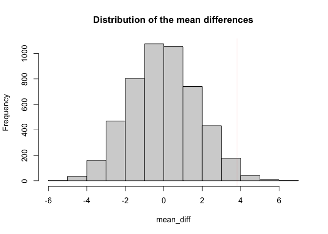

Statistical Methods - 2016 U.S. Election
================
Imtiaz Rashid
4/19/2021

## 1\. Introduction

<style>
body {
text-align: justify}
</style>

Politics permeates every aspect of our lives. The leaders we elect has
tremendous impact on the direction that our country and the overall
world goes in. The 2016 United States presidential election has been
noted as one of the most significant election in modern U.S. history
where Donald Trump pulled a stunning upset victory over Hillary Clinton
based on a number of factors. The purpose of this investigative project
is to model and explain the factors that contributed to the election
outcome.

#### Dataset Descriptions

The first dataset, **election**, was obtained from Vincent
Arel-Bundock’s Github containing a list of R datasets. The dataset was
refined to contain the variables the region that a state is classified
as according to the U.S. census, voter turnout rate (%), college
graduation rate (%), GDP per capita ($) and whether a state was won by
Trump or not.

The second dataset, **age\_religion**, is composed of data from the
CIA’s World Factvook and the Pew Research Center. The dataset was
refined to contain one single variable, religiosity (%).

The two datasets were merged into one full dataset, **USelection**. Both
of the original datasets contained the common variable of state, which
is all 50 states of the United States plus the city of Washington D.C.
The final dataset contains 8 variables with 51 observations.

#### Significance & Projections

Consuming politics has always been a personal hobby of mine and given
the unexpected outcome of the 2016 election that shocked people across
the political spectrum, I wanted to gain a deeper understanding of the
factors that may have been overlooked in explaining Trump’s victory.
Based on the exploratory data analysis, it is expected that voter
turnout rate and religiosity will be the most significant associations
that contributed to the outcome of the election.

#### Tidy Data & Full Join

In a tidy dataset, each variable is saved in its own column and each
observation is saved in its own row. Tidy data complements R’s
vectorized operations as it automatically preserves observations as
variables are manipulated. Based on these conditions, each dataset meets
the requirements of tidy data already & require no further modification.

Each dataset however underwent a cleaning process to remove extraneous
variables and renaming variables of interest for clarity. The two
datasets underwent a full join to keep all observations for each
variable.

``` r
# Opens 'election' dataset in R
library(readxl)
election <- read_excel("election_turnout.xlsx")

# Cleans up 'election' dataset
election <- election %>%
  # Removes extraneous variables
  select(-x, -year, -division, -perhsed, -ss) %>% 
  # Renames variables for clarity
  rename(turnout="turnoutho", college_grad="percoled", gdp_capita="gdppercap", trump_won_bin="trumpw") %>%
  # Transform binary 1, 0 values into "yes", "no" respectively
  mutate(trump_won = ifelse(trump_won_bin == 1, "yes", "no"))

# Opens 'age_religion' dataset in R
library(readxl)
age_religion <- read_excel("age_religion.xlsx")

# Cleans up 'age_religion' dataset
religion <- age_religion %>%
  # Removes extraneous variables
  select(-median_age)

# Merges 'election' & 'religion' datsets by keeping all rows & observations from both datasets
USelection <- election %>%
  full_join(religion, by = "state") %>%
  # Reorders appearance of variables in dataset for clarity
 select(state, region, trump_won_bin, trump_won, turnout, religiosity, college_grad, gdp_capita)


# Shows final dataset in tabular form
print(USelection)
```

    ## # A tibble: 51 x 8
    ##    state        region  trump_won_bin trump_won turnout religiosity college_grad
    ##    <chr>        <chr>           <dbl> <chr>       <dbl>       <dbl>        <dbl>
    ##  1 Alabama      South               1 yes          59            77         23.5
    ##  2 Alaska       West                1 yes          61.3          45         28  
    ##  3 Arizona      West                1 yes          55            53         27.5
    ##  4 Arkansas     South               1 yes          52.8          70         21.1
    ##  5 California   West                0 no           56.7          49         31.4
    ##  6 Colorado     West                0 no           70.1          47         38.1
    ##  7 Connecticut  Northe…             0 no           65.2          43         37.6
    ##  8 Delaware     South               0 no           64.4          52         30  
    ##  9 District of… South               0 no           60.9          53         54.6
    ## 10 Florida      South               1 yes          64.6          54         27.3
    ## # … with 41 more rows, and 1 more variable: gdp_capita <dbl>

``` r
# Shows all variables of final dataset
glimpse(USelection)
```

    ## Rows: 51
    ## Columns: 8
    ## $ state         <chr> "Alabama", "Alaska", "Arizona", "Arkansas", "California"…
    ## $ region        <chr> "South", "West", "West", "South", "West", "West", "North…
    ## $ trump_won_bin <dbl> 1, 1, 1, 1, 0, 0, 0, 0, 0, 1, 1, 0, 1, 0, 1, 1, 1, 1, 1,…
    ## $ trump_won     <chr> "yes", "yes", "yes", "yes", "no", "no", "no", "no", "no"…
    ## $ turnout       <dbl> 59.0, 61.3, 55.0, 52.8, 56.7, 70.1, 65.2, 64.4, 60.9, 64…
    ## $ religiosity   <dbl> 77, 45, 53, 70, 49, 47, 43, 52, 53, 54, 66, 47, 51, 51, …
    ## $ college_grad  <dbl> 23.5, 28.0, 27.5, 21.1, 31.4, 38.1, 37.6, 30.0, 54.6, 27…
    ## $ gdp_capita    <dbl> 42663, 81801, 43269, 41129, 61924, 58009, 72331, 69930, …

The final dataset contains 8 variables with 51 observations.

## 2\. Exploratory Data Analysis

#### Statistics Summary

``` r
# Table of summary statistics for numeric variables
ssTable <- matrix(c(mean(USelection$turnout), median(USelection$turnout), min(USelection$turnout),
                     max(USelection$turnout), sd(USelection$turnout), mean(USelection$religiosity),
                      median(USelection$religiosity), min(USelection$religiosity), 
                      max(USelection$religiosity), sd(USelection$religiosity), 
                      mean(USelection$college_grad), median(USelection$college_grad), 
                      min(USelection$college_grad), max(USelection$college_grad), 
                      sd(USelection$college_grad), mean(USelection$gdp_capita),
                     median(USelection$gdp_capita), min(USelection$gdp_capita),
                     max(USelection$gdp_capita), sd(USelection$gdp_capita)), ncol = 5, byrow = T)

# Names columns based on summary statistics
colnames(ssTable) <- c("Mean", "Median", "Min", "Max", "St Dev")

# Names rows based on numeric variables
rownames(ssTable) <- c("Voter Turnout (%)", "Religiosity (%)", "Completed College (%)", "GDP Per Capita ($)")

# Table of statistics with variables
ssTable <- as.data.frame(ssTable)
knitr::kable(ssTable)
```

|                       |        Mean |  Median |     Min |      Max |       St Dev |
| :-------------------- | ----------: | ------: | ------: | -------: | -----------: |
| Voter Turnout (%)     |    60.82157 |    60.9 |    42.2 |     74.2 |     6.117199 |
| Religiosity (%)       |    54.66667 |    54.0 |    33.0 |     77.0 |    10.637042 |
| Completed College (%) |    29.51373 |    28.4 |    19.2 |     54.6 |     6.057723 |
| GDP Per Capita ($)    | 55785.11765 | 51902.0 | 35717.0 | 181185.0 | 20689.240143 |

The election had an average voter turnout rate of 60.82% on the national
level. The highest voter turnout state was at 74.2% whereas the lowest
voter turnout state was at 42.2 The most religious state had a
religiosity of 77% while the least religious state had a religiosity of
33% for a national average of 54.67%. In the most educated state, 54.6%
of its residents completed college while only 19.2% of people in the
least educated state completed college. The U.S. has a median GDP per
capita of $51,902.

#### Correlation Matrix

``` r
# Creates dataset with only numeric variables
USelection_num <- USelection %>%
  select(-state, -region, -trump_won)

cor(USelection_num) %>%
  # Save as a data frame
  as.data.frame %>%
  # Convert row names to an explicit variable
  rownames_to_column %>%
  # Pivot so that all correlations appear in the same column
  pivot_longer(-1, names_to = "other_var", values_to = "correlation") %>%
  # Specify variables are displayed alphabetically from top to bottom
  ggplot(aes(rowname, factor(other_var, levels = rev(levels(factor(other_var)))), fill=correlation), stat=summary) +
  # Heatmap with geom_tile
  geom_tile() +
  # Change the scale to make the middle appear neutral
  scale_fill_gradient2(low="red",mid="white",high="blue") +
  # Overlay values
  geom_text(aes(label = round(correlation,2)), color = "black", size = 4) +
  # Give title & labels
  labs(title = "Correlation Matrix for U.S. Election Variables", x = "", y = "") 
```


The correlation heatmap matrix displays a number of potential
associations between variables based on their strength and direction.
Voter turnout rate is positively correlated to the percentage of a
state’s population that has completed college while negatively
correlated with religiosity. The strongest correlation is positively
linked between a state’s GDP per capita and the percentage of its
residents who have graduated from college. On the otherhand, the weakest
correlation to exist is between voter turnout rate and a state’s GDP per
capita.

#### Proportion of Clinton vs. Trump States by Region

``` r
USelection %>%
  # Creates bar plot of Clinton vs. Trump states by region
  ggplot(aes(x=trump_won, fill=region, stat="summary")) + geom_bar(position = "fill") +
  # Adds titles & axes to bar plot
  ggtitle("Proportion of Clinton vs. Trump States by Region") + xlab("Trump Won") + ylab("Density") +
  # Custom color palette for bars on plot
scale_fill_brewer(palette = "Spectral")
```


Trump won states largely in the South and North Central regions of the
country while Clinton won states largely in the Northeast and West
regions of the country.

#### Means of Voter Turnout, Religiosity, College Completion & GDP Per Capita Per Region

``` r
# Represent the mean turnout per region
USelection %>%
  select(region, turnout) %>%
  pivot_longer(-1,names_to='DV', values_to='measure') %>%
  ggplot(aes(region, measure ,fill = region)) +
  geom_bar(stat="summary", fun = "mean") +
  geom_errorbar(stat="summary", fun.data = "mean_se", width=.5) +
  facet_wrap(~DV, nrow=2) + coord_flip() + ylab("") + theme(legend.position = "none") +
  ggtitle("Mean Voter Turnout Rate By Region") + ylab("Voter Turnout Rate (%)")
```


``` r
# Represent the mean religiosity per region
USelection %>%
  select(region, religiosity) %>%
  pivot_longer(-1,names_to='DV', values_to='measure') %>%
  ggplot(aes(region, measure ,fill = region)) +
  geom_bar(stat="summary", fun = "mean") +
  geom_errorbar(stat="summary", fun.data = "mean_se", width=.5) +
  facet_wrap(~DV, nrow=2) + coord_flip() + ylab("") + theme(legend.position = "none") +
  ggtitle("Mean Religiosity By Region") + ylab("Religiosity (%)")
```


``` r
# Represent the mean college completion rate per region
USelection %>%
  select(region, college_grad) %>%
  pivot_longer(-1,names_to='DV', values_to='measure') %>%
  ggplot(aes(region, measure ,fill = region)) +
  geom_bar(stat="summary", fun = "mean") +
  geom_errorbar(stat="summary", fun.data = "mean_se", width=.5) +
  facet_wrap(~DV, nrow=2) + coord_flip() + ylab("") + theme(legend.position = "none") +
  ggtitle("Mean College Grad Rate By Region") + ylab("College Grad Rate (%)")
```


``` r
# Represent the mean GDP per capita per region
USelection %>%
  select(region, gdp_capita) %>%
  pivot_longer(-1,names_to='DV', values_to='measure') %>%
  ggplot(aes(region, measure ,fill = region)) +
  geom_bar(stat="summary", fun = "mean") +
  geom_errorbar(stat="summary", fun.data = "mean_se", width=.5) +
  facet_wrap(~DV, nrow=2) + coord_flip() + ylab("") + theme(legend.position = "none") +
  ggtitle("Mean GDP Per Capita By Region") + ylab("GDP Per Capita ($)")
```


By eyeball glancing, the mean voter turnout rate and mean religiosity
appears to significantly differ by region whereas the mean college
graduation rate and mean GDP per capita not as much.

#### Effect of Religiosity on Voter Turnout & Election Outcome

``` r
USelection %>%
  # Creates scatter plot of how religiosity affects voter turnout
  ggplot(aes(x=religiosity, y=turnout)) + 
# Labels & sizes points to consider whether state was won by Trump & its GDP per capita
  geom_point(aes(color=trump_won, size=gdp_capita)) +
# Adds titles & axes to scatter plot
  ggtitle("Effect of Religiosity on Voter Turnout & Election Outcome") + xlab("Religiosity (%)") +
  ylab("Voter Turnout (%)") +
# Custom color palette for points on plot
  scale_color_brewer(palette="Dark2")
```


A negative correlation exists between a state’s religiosity and its
voter turnout rate and the percentage of its residents that graduated
from college. Trump dominated in states that were more religious and
less wealthier on average compared to states won by Clinton, despite
having a lower voter turnout rate.

#### 

``` r
USelection %>%
  # Creates scatter plot of how religiosity affects voter turnout
  ggplot(aes(x=college_grad, y=turnout)) + 
  # Adds points & regression line
  geom_point(color = "darkgreen") + 
  geom_smooth(method = lm, linetype = "dashed", color = "red", fill = "blue") + 
  # Adds titles & axes to scatter plot
  ggtitle("Regression Plot of College Gradutation Rate vs. Voter Turnout Rate") +
  xlab("College Grad Rate (%)") + ylab("Votern Turnout Rate (%)")
```


The regression line shows a moderately strong correlation between
college graduation rate and voter turnout rate for a state. The two
variables were shown to be moderately related in the correlation matrix
which is validated by the regression line.

## 3\. MANOVA

MANOVA or Multivariate Analysis of Variance compares multiple numeric
response variables across different groups in addition to performing
multiple one-way ANOVAs with a single significance test. In a nutshell,
MANOVA tests whether any numeric variables displays a mean difference
across levels of a categorical variable.

There are multiple assumptions required to be met for MANOVA to be
conducted:

  - Random sample & independent observations
  - Multivariate normality of the numeric response variables
  - Homogeneity of within-groups covariance matrices where variances for
    each response across groups are equal & covariance between any 2
    responses are equal
  - Linear relationship among response variables, but no multiple
    collinearity
  - No extreme univariate or multivariate outliers

MANOVA was conducted to investigate how the mean voter turnout rate,
mean religiosity, mean college graduation rate and mean GDP per capita
differed between 4 regions of the United States. It is assumed that the
assumptions are likely met.

#### MANOVA test

``` r
# Performs MANOVA with response variables listed in cbind()
manova <- manova(cbind(turnout, religiosity, college_grad, gdp_capita) ~ region, data = USelection)

# Output of MANOVA
summary(manova)
```

    ##           Df  Pillai approx F num Df den Df    Pr(>F)    
    ## region     3 0.88932   4.8455     12    138 1.281e-06 ***
    ## Residuals 47                                             
    ## ---
    ## Signif. codes:  0 '***' 0.001 '**' 0.01 '*' 0.05 '.' 0.1 ' ' 1

According to the MANOVA test, at least one of the response variables
differs significantly by region.

#### One-Way ANOVA tests

``` r
# If MANOVA is significant then we can perform one-way ANOVA for each variable
summary.aov(manova)
```

    ##  Response turnout :
    ##             Df  Sum Sq Mean Sq F value  Pr(>F)  
    ## region       3  341.89 113.962  3.5028 0.02247 *
    ## Residuals   47 1529.12  32.534                  
    ## ---
    ## Signif. codes:  0 '***' 0.001 '**' 0.01 '*' 0.05 '.' 0.1 ' ' 1
    ## 
    ##  Response religiosity :
    ##             Df Sum Sq Mean Sq F value    Pr(>F)    
    ## region       3 3438.9  1146.3  24.285 1.225e-09 ***
    ## Residuals   47 2218.5    47.2                      
    ## ---
    ## Signif. codes:  0 '***' 0.001 '**' 0.01 '*' 0.05 '.' 0.1 ' ' 1
    ## 
    ##  Response college_grad :
    ##             Df  Sum Sq Mean Sq F value  Pr(>F)  
    ## region       3  273.93  91.311  2.7495 0.05314 .
    ## Residuals   47 1560.87  33.210                  
    ## ---
    ## Signif. codes:  0 '***' 0.001 '**' 0.01 '*' 0.05 '.' 0.1 ' ' 1
    ## 
    ##  Response gdp_capita :
    ##             Df     Sum Sq   Mean Sq F value Pr(>F)
    ## region       3 1.2677e+08  42255312  0.0933 0.9633
    ## Residuals   47 2.1275e+10 452669510

According to the full results of the one-way ANOVA tests, the response
variables of voter turnout rate and religiosity differed significantly
across the four regions of the United States.

#### Post-Hoc Analysis

Post-hoc tests are utilized to uncover specific differences between
three or more group means when an ANOVA test is significant.

``` r
# If ANOVA is significant, then we can perform post-hoc analysis

# For voter turnout rate
pairwise.t.test(USelection$turnout, USelection$region, p.adj="none")
```

    ## 
    ##  Pairwise comparisons using t tests with pooled SD 
    ## 
    ## data:  USelection$turnout and USelection$region 
    ## 
    ##           North Central Northeast South
    ## Northeast 0.609         -         -    
    ## South     0.030         0.013     -    
    ## West      0.060         0.026     0.849
    ## 
    ## P value adjustment method: none

``` r
# For religiosity
pairwise.t.test(USelection$religiosity, USelection$region, p.adj="none")
```

    ## 
    ##  Pairwise comparisons using t tests with pooled SD 
    ## 
    ## data:  USelection$religiosity and USelection$region 
    ## 
    ##           North Central Northeast South  
    ## Northeast 0.00038       -         -      
    ## South     8.3e-05       2.2e-10   -      
    ## West      0.23693       0.00756   7.3e-07
    ## 
    ## P value adjustment method: none

Based on the significance level of 0.05…

There is a significant difference in voter turnout rate between the
regions of:

  - North Central & South (p = 0.03)
  - Northeast & South (p = 0.013)
  - Northeast & West (p = 0.026)

There is a significant difference in religiosity between the regions of:

  - North Central & Northeast (p = 0.00038)
  - North Central & South (p = 8.3e-05)
  - Northeast & South (p = 2.2e-10)
  - Northeast & West (p = 0.00756)
  - South & West (p = 7.3e-0.7)

#### Bonferroni Correction

Bonferroni correction is a multiple-comparison correction employed when
several dependent or independent statistical tests are being performed
simultaneously.

``` r
# Probability of making at least one type I error
# Pr(at least 1 type I error) = 1 - Pr(no type I error) = 1 - 0.95^x
# x = 17 tests

1-(0.95^17)
```

    ## [1] 0.5818797

``` r
# Bonferroni correction
0.05/17
```

    ## [1] 0.002941176

  - 17 hypothesis tests were conducted in total. There is a 58.19%
    chance that a type I error was made.
  - A Bonferroni significance level of 0.003 should be used to keep the
    overall type I error rate at 0.05.
  - After applying Bonferroni’s correction, there is no longer any
    significant difference in voter turnout rate between the regions of:
      - North Central & South (p = 0.03)
      - Northeast & South (p = 0.013)
      - Northeast & West (p = 0.026)
  - After applying Bonferroni’s correction, there is no longer any
    significant difference in religiosity between the regions of:
      - Northeast & West (p = 0.00756)

## 4\. Randomization Test

The randomization test scrambles the relationship between variables of a
dataset to generate a null distribution to compare against to an
observed test statistic.

  - Null Hypothesis (Ho): Voter turnout rate is the same in Trump won
    states and Clinton won states.
  - Alternative Hypothesis (Ha): Voter turnout rate is different in
    Trump won states and Clinton won states.

#### Observed Difference in Voter Turnout Rate

``` r
# Observed difference of turnout between Trump & Clinton states
obs_diff <- USelection %>%
  group_by(trump_won) %>%
  summarise(means = mean(turnout)) %>%
  summarise(mean_diff = diff(means)) %>%
  pull
obs_diff
```

    ## [1] -3.808571

The observed difference of the mean voter turnout rate between Trump won
states and Clinton won states is 3.81%.

#### Randomization Test - Loop 5000x

``` r
set.seed(348)

USelection %>%
  #Represents the distribution of turnout rate for each state type
  ggplot(aes(turnout, fill=trump_won)) +
  geom_histogram(bins = 6.5) + facet_wrap(~trump_won, ncol=2) + theme(legend.position="none")
```


``` r
# Create an empty vector to store the mean differences
mean_diff <- vector()

# Create many randomization with a for loop
for(i in 1:5000){
temp <- data.frame(trump_won = USelection$trump_won, turnout = sample(USelection$turnout))
mean_diff[i] <- temp %>%
group_by(trump_won) %>%
summarize(means = mean(turnout)) %>%
summarize(mean_diff = diff(means)) %>%
pull
}

#Represent the distribution of the mean differences with a vertical line showing the true difference
{hist(mean_diff, main="Distribution of the mean differences"); abline(v = 3.81, col="red")}
```



The plots of the null distribution and the test statistic displays the
results of the randomization test. With a test statistic of 3.81 and
being further away from 0, the model appears to differ from the null
distribution.

#### Two-sided p-values

``` r
# Calculate the corresponding two-sided p-value for weight
mean(mean_diff > -obs_diff | mean_diff < obs_diff)
```

    ## [1] 0.0264

``` r
# Compare to a Welch's t-test for turnout
t.test(turnout ~ trump_won, data = USelection)
```

    ## 
    ##  Welch Two Sample t-test
    ## 
    ## data:  turnout by trump_won
    ## t = 2.1378, df = 33.1, p-value = 0.04001
    ## alternative hypothesis: true difference in means is not equal to 0
    ## 95 percent confidence interval:
    ##  0.1843803 7.4327625
    ## sample estimates:
    ##  mean in group no mean in group yes 
    ##          63.06190          59.25333

A Welch t-test is a two-sample location test which is used to assess the
hypothesis that two populations have equal means. As p \< 0.05, we
reject the null hypothesis that voter turnout rate is the same in Trump
won states and Clinton won states.

## 5\. Linear Regression Model

A linear regression attempts to model the relationship between two or
more variables by fitting a linear equation to the observed data. One
variable is considered to be an explanatory variable, and the other is
considered to be a dependent variable.

There are a few assumptions required to be met for linear regression
model to be conducted:

  - Linear function: the mean response is a linear function of Xi
  - Independent: the errors are independent
  - Normally distributed: the errors are normally distributed
  - Equal variances: the errors have equal variances

A linear regression model was conducted to quantitatively investigate
the relationship of religiosity and whether Trump won the state or not
and their interactions with voter turnout rate.

#### Centering variables

``` r
# Centers religiosity variable
USelection$religiosity_c <- (USelection$religiosity) - mean(USelection$religiosity, na.rm = TRUE)
```

Centering explanatory variables helps reduce multicollinearity in a
regression model.

#### Fitting a Linear Regression Model

``` r
# Fits a model with Clinton won states as the reference (by default)
fit <- lm(turnout ~ religiosity_c * trump_won, data = USelection)
```

A linear regression model was fitted with voter turnout rate as the
response and the variables religiosity and the who the state was won by
as predictors as well as their interaction. The states won by Clinton
and lost by Trump serve as the reference variable by default.

#### Assessing Assumptions of Linear Regression

``` r
# Linearity
plot(fit, which = 1)
```


``` r
# Breusch-Pagan test for equal variance
# H0: homoscedasticity
bptest(fit)
```

    ## 
    ##  studentized Breusch-Pagan test
    ## 
    ## data:  fit
    ## BP = 2.7492, df = 3, p-value = 0.4319

``` r
# Normality by Q-Q plot for the residuals
plot(fit, which = 2)
```


``` r
# Shapiro-Wilk test for normality
# H0: normality
shapiro.test(fit$residuals)
```

    ## 
    ##  Shapiro-Wilk normality test
    ## 
    ## data:  fit$residuals
    ## W = 0.93136, p-value = 0.005617

The assumptions for linearity and equal variance were met. However, the
assumption for normality was not met as we reject the null hypothesis of
the Shapiro-Wilk normality test (p = 0.0056).

#### Interpreting the Linear Regression

``` r
# Views linear regression output
summary(fit)
```

    ## 
    ## Call:
    ## lm(formula = turnout ~ religiosity_c * trump_won, data = USelection)
    ## 
    ## Residuals:
    ##      Min       1Q   Median       3Q      Max 
    ## -20.8855  -3.2127   0.5778   3.3786  11.6092 
    ## 
    ## Coefficients:
    ##                            Estimate Std. Error t value Pr(>|t|)    
    ## (Intercept)                61.18915    1.65883  36.887   <2e-16 ***
    ## religiosity_c              -0.24735    0.15334  -1.613    0.113    
    ## trump_wonyes               -0.28183    2.02132  -0.139    0.890    
    ## religiosity_c:trump_wonyes -0.06473    0.18979  -0.341    0.735    
    ## ---
    ## Signif. codes:  0 '***' 0.001 '**' 0.01 '*' 0.05 '.' 0.1 ' ' 1
    ## 
    ## Residual standard error: 5.43 on 47 degrees of freedom
    ## Multiple R-squared:  0.2595, Adjusted R-squared:  0.2122 
    ## F-statistic: 5.489 on 3 and 47 DF,  p-value: 0.002569

21.22% of variation in the response is explained by the model.

  - Religiosity is NOT significantly associated with voter turnout rate
    in states lost by Trump. For every 1% increase in religiosity, voter
    turnout rate decreases by 0.25% (t = -1.613, df = 47, p = 0.113).
  - States won by Trump are NOT significantly associated with voter
    turnout rate. For states with average religiosity, states won by
    Trump have predicted voter turnout rate that is 0.28% lower than
    states won by Clinton (t = -0.139, df = 47, p = 0.89).
  - There is no significant interaction between religiosity and whether
    a state was won by Trump or not. The slope for religiosity on voter
    turnout rate is 0.065 units lower for states won by Trump compared
    to states won by Clinton (t = -0.341, df = 47, p = 0.735).

#### Visualizing the Linear Regression

``` r
# Plot to visualize linear regression
ggplot(USelection, aes(x = religiosity_c, y = turnout, color = trump_won)) +
  geom_point() + geom_smooth(method = lm, se = FALSE, fullrange = TRUE) + ggtitle("Linear Relationship Between Election Factors") + xlab("Religiosity, centered (%)") + ylab("Voter Turnout Rate (%)")
```


The plot visually represents the conclusions derived from the linear
regression model.

#### Robust Standard Errors

``` r
# Uncorrected Standard Errors
summary(fit)$coef
```

    ##                               Estimate Std. Error    t value     Pr(>|t|)
    ## (Intercept)                61.18914799   1.658829 36.8869485 2.373265e-36
    ## religiosity_c              -0.24734523   0.153338 -1.6130718 1.134241e-01
    ## trump_wonyes               -0.28182549   2.021319 -0.1394265 8.897089e-01
    ## religiosity_c:trump_wonyes -0.06472819   0.189790 -0.3410516 7.345847e-01

``` r
# Robust Standard Errors
coeftest(fit, vcov = vcovHC(fit))
```

    ## 
    ## t test of coefficients:
    ## 
    ##                             Estimate Std. Error t value Pr(>|t|)    
    ## (Intercept)                61.189148   2.067168 29.6005   <2e-16 ***
    ## religiosity_c              -0.247345   0.147756 -1.6740   0.1008    
    ## trump_wonyes               -0.281825   2.241045 -0.1258   0.9005    
    ## religiosity_c:trump_wonyes -0.064728   0.172630 -0.3750   0.7094    
    ## ---
    ## Signif. codes:  0 '***' 0.001 '**' 0.01 '*' 0.05 '.' 0.1 ' ' 1

Compared to uncorrected standard errors, the conclusions for the robust
standard errors are the same.

  - Religiosity is NOT significantly associated with voter turnout rate
    in states lost by Trump. For every 1% increase in religiosity, voter
    turnout rate decreases by 0.25% (t = -1.674, df = 47, p = 0.1).
  - States won by Trump are NOT significantly associated with voter
    turnout rate. For states with average religiosity, states won by
    Trump have predicted voter turnout rate that is 0.28% lower than
    states won by Clinton (t = -0.126, df = 47, p = 0.9).
  - There is no significant interaction between religiosity and whether
    a state was won by Trump or not. The slope for religiosity on voter
    turnout rate is 0.065 units lower for states won by Trump compared
    to states won by Clinton (t = -0.375, df = 47, p = 0.71).

#### Bootstrapped Standard Errors

``` r
set.seed(348)

# When assumptions are violated (homoscedasticity, normality, small sample size)
# use bootstrap samples to estimate coefficients, SEs, fitted values, ...
# Example of estimating coefficients SEs
# Use the function replicate to repeat the process (similar to a for loop)
samp_SEs <- replicate(5000, {
   # Bootstrap your data (resample observations)
  boot_data <- sample_frac(USelection, replace = TRUE)
  # Fit regression model
  fitboot <- lm(turnout ~ religiosity_c * trump_won, data = boot_data)
  # Save the coefficients
  coef(fitboot)
})

# Estimated SEs
samp_SEs %>%
# Transpose the obtained matrices
  t %>%
# Consider the matrix as a data frame
  as.data.frame %>%
# Compute the standard error (standard deviation of the sampling distribution)
  summarize_all(sd)
```

<div data-pagedtable="false">

<script data-pagedtable-source type="application/json">
{"columns":[{"label":["(Intercept)"],"name":[1],"type":["dbl"],"align":["right"]},{"label":["religiosity_c"],"name":[2],"type":["dbl"],"align":["right"]},{"label":["trump_wonyes"],"name":[3],"type":["dbl"],"align":["right"]},{"label":["religiosity_c:trump_wonyes"],"name":[4],"type":["dbl"],"align":["right"]}],"data":[{"1":"1.945538","2":"0.1441062","3":"2.098448","4":"0.1668493"}],"options":{"columns":{"min":{},"max":[10]},"rows":{"min":[10],"max":[10]},"pages":{}}}
  </script>

</div>

Compared to the uncorrected standard errors and robust standard errors,
the coefficients of the bootstrapped standard errors have changed.

  - For every 1% increase in religiosity, voter turnout rate decreases
    by 0.144% in states lost by Trump.
  - For states with average religiosity, states won by Trump have
    predicted voter turnout rate that is 2.1% lower than states won by
    Clinton.
  - The slope for religiosity on voter turnout rate is 0.167 units
    higher for states won by Trump compared to states won by Clinton.

## 6\. Logistic Regression

Linear regression is utilized to predict the continuous dependent
variable using a given set of independent variables. On the otherhand
however, logistic regression is used to predict the categorical
dependent variable using a given set of independent variables. Whereas
linear regression predicts the mean, logistic regression predicts
probability.

A logistic regression model was conducted to quantitatively investigate
the relationship of religiosity and college graduation rate with whether
Trump won the state or not.

#### Fitting a Logistic Regression Model

``` r
# Fits a model with Trump won states as the reference (by default)
fit1 <- glm(trump_won_bin ~ religiosity + college_grad, data = USelection, family = "binomial")
# Views logistic regression output
summary(fit1)
```

    ## 
    ## Call:
    ## glm(formula = trump_won_bin ~ religiosity + college_grad, family = "binomial", 
    ##     data = USelection)
    ## 
    ## Deviance Residuals: 
    ##      Min        1Q    Median        3Q       Max  
    ## -2.50637  -0.31223   0.03506   0.40310   1.35227  
    ## 
    ## Coefficients:
    ##              Estimate Std. Error z value Pr(>|z|)   
    ## (Intercept)   5.82366    6.80735   0.855  0.39228   
    ## religiosity   0.18375    0.08791   2.090  0.03659 * 
    ## college_grad -0.51003    0.17873  -2.854  0.00432 **
    ## ---
    ## Signif. codes:  0 '***' 0.001 '**' 0.01 '*' 0.05 '.' 0.1 ' ' 1
    ## 
    ## (Dispersion parameter for binomial family taken to be 1)
    ## 
    ##     Null deviance: 69.104  on 50  degrees of freedom
    ## Residual deviance: 27.743  on 48  degrees of freedom
    ## AIC: 33.743
    ## 
    ## Number of Fisher Scoring iterations: 7

``` r
# Interpret the coefficients by considering the odds (inverse of log(odds))
coef(fit1) %>% exp %>% round(5) %>% data.frame
```

<div data-pagedtable="false">

<script data-pagedtable-source type="application/json">
{"columns":[{"label":[""],"name":["_rn_"],"type":[""],"align":["left"]},{"label":["."],"name":[1],"type":["dbl"],"align":["right"]}],"data":[{"1":"338.20803","_rn_":"(Intercept)"},{"1":"1.20171","_rn_":"religiosity"},{"1":"0.60048","_rn_":"college_grad"}],"options":{"columns":{"min":{},"max":[10]},"rows":{"min":[10],"max":[10]},"pages":{}}}
  </script>

</div>

  - Controlling for college graduation rates, every 1% increase in
    religiosity multiplies the odds of Trump winning a state by 1.2.
  - Controlling for religiosity, every 1% increase in college graduation
    rate multiplies the odds of Trump winning a state by 0.6.

#### Confusion Matrix

A confusion matrix is a table that is used to describe the performance
of a classification model on a set of test data for which the true
values are known.

``` r
#Changes binary "1", "0" values to "yes", "no" respectively across relevant categorical variables
USelection <- USelection %>% mutate(outcome = ifelse(trump_won_bin == 1, "yes", "no")) 

# Add predicted probabilities to the dataset
USelection$prob <- predict(fit1, type = "response")

# Predicted outcome is based on the probability of Trump winning state
# if the probability is greater than 0.5, then Trump won the state
USelection$predicted <- ifelse(USelection$prob > .5, "yes", "no")

# Confusion matrix
table(truth = USelection$outcome, prediction = USelection$predicted)
```

    ##      prediction
    ## truth no yes
    ##   no  18   3
    ##   yes  3  27

  - Accuracy: correctly classified cases
  - Sensitivity: true positive rate (TPR)
  - Specificity: true negative rate (TNR)
  - Precision: positive predicive value (PPV)

<!-- end list -->

``` r
# Accuracy (correctly classified cases)
(18+27)/51
```

    ## [1] 0.8823529

``` r
# Sensitivity (True Positive Rate, TPR)
27/30
```

    ## [1] 0.9

``` r
# Specificity (True Negative Rate, TNR)
18/21
```

    ## [1] 0.8571429

``` r
# Precision (Positive Predictive Value, PPV)
27/30
```

    ## [1] 0.9

  - The overall model has an accuracy rate of 88.24%.
  - The model has a true positive rate of 90%.
  - The model has a true negative rate of 85.71%.
  - The model has a positive predictive value of 90%.

#### Plot Density of Log Odds (Logit)

``` r
# Save the predicted log-odds in the dataset
USelection$logit <- predict(fit1)

# Compare to the outcome in the dataset with a density plot
ggplot(USelection, aes(logit, fill = as.factor(outcome))) + geom_density(alpha = .3) + geom_vline(xintercept = 0, lty = 2) + labs(fill = "trump_won") + ggtitle("Logit Odds")
```


The plot density compares the predicted log odds in the dataset to the
outcomes in the dataset of whether Trump won the state or not.

#### ROC & AUC

Receiver Operating Characteristic (ROC) curve is a graphical plot
illustrating the performance of a binary classification model at at
classification thresholds. The curve plots two parameters: false
positive rate vs. true positive rate. The most optimal ROC curve has a
false positive rate of 0% and true positive rate of 100%.

Area under the curve (AUC) is the overall measure of model performance.
The higher the area under the curve, the better prediction power the
model has.

``` r
# Plot ROC depending on values of y and its probabilities displaying some cutoff values
ROCplot <- ggplot(USelection) + geom_roc(aes(d = trump_won_bin, m = prob), cutoffs.at = list(0.1, 0.5, 0.9)) + ggtitle("ROC Plot")
ROCplot
```


``` r
# Calculate the area under the curve
AUC <- calc_auc(ROCplot)$AUC
AUC
```

    ## [1] 0.947619

Based on the area under the ROC plot, a randomly selected state from the
positive group has a test value larger than a randomly chosen state from
the negative group 94.76% of the time. Based on the rule of thumb, the
model is great.

    ##                                                                                              sysname 
    ##                                                                                             "Darwin" 
    ##                                                                                              release 
    ##                                                                                             "19.6.0" 
    ##                                                                                              version 
    ## "Darwin Kernel Version 19.6.0: Thu Oct 29 22:56:45 PDT 2020; root:xnu-6153.141.2.2~1/RELEASE_X86_64" 
    ##                                                                                             nodename 
    ##                                                                       "Imtiazs-Air.fios-router.home" 
    ##                                                                                              machine 
    ##                                                                                             "x86_64" 
    ##                                                                                                login 
    ##                                                                                               "root" 
    ##                                                                                                 user 
    ##                                                                                       "imtiazrashid" 
    ##                                                                                       effective_user 
    ##                                                                                       "imtiazrashid"
